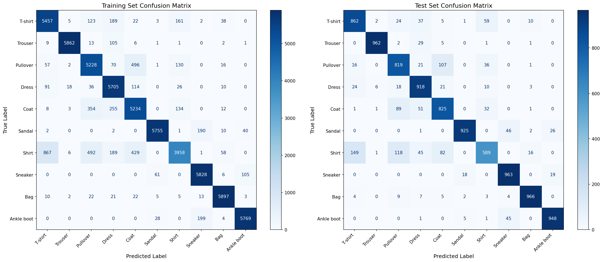
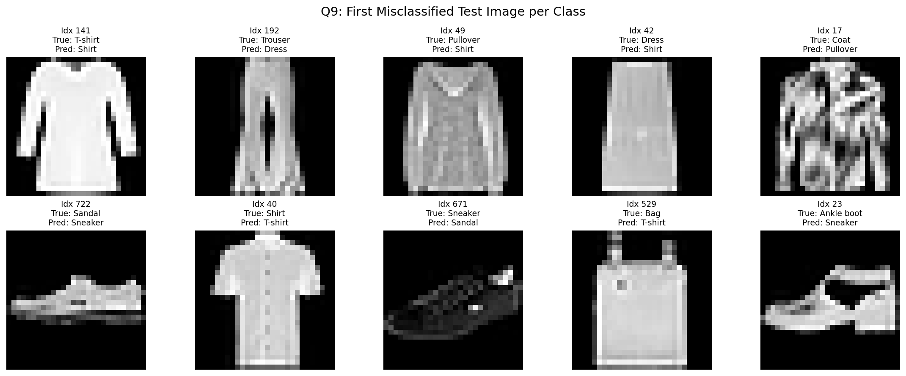
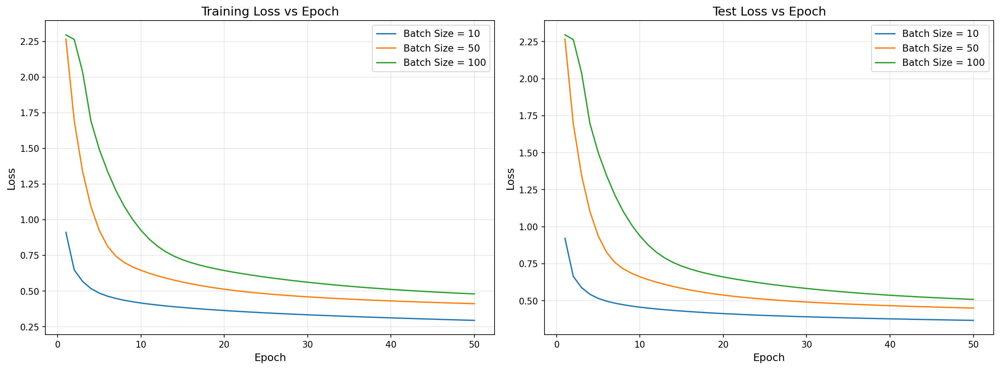
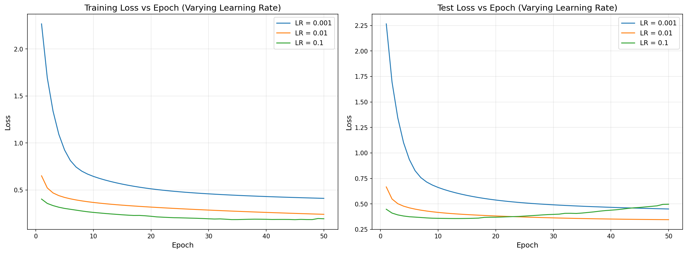

# Neural Network from Scratch — Fashion-MNIST Classifier

## Overview

This project implements a **single-hidden-layer neural network from scratch** using PyTorch tensors (but **no built-in modules** like `nn.Linear`, `nn.Sigmoid`, etc.). The network classifies 28×28 grayscale images from the **Fashion-MNIST** dataset into 10 clothing categories.

### Network Architecture

```
Input (784) → Linear → Sigmoid → Linear → Softmax → Output (10)
```

| Layer       | Input Size | Output Size | Description                        |
|-------------|------------|-------------|------------------------------------|
| Flatten     | (1, 28, 28) | (784,)    | Reshape image to vector            |
| Linear 1    | 784        | 256         | Weights α ∈ ℝ^(256×784), bias ∈ ℝ^256 |
| Sigmoid     | 256        | 256         | σ(a) = 1/(1+e^(-a))               |
| Linear 2    | 256        | 10          | Weights β ∈ ℝ^(10×256), bias ∈ ℝ^10  |
| Softmax     | 10         | 10          | Inside CrossEntropyFunction        |

---

## File Structure

```
nn_implementation_code/
├── custom_functions.py    ← Core math: forward & backward for each operation
├── custom_modules.py      ← Wraps Functions into nn.Module-compatible layers
├── base_experiment.py     ← Model definition + training/evaluation functions
├── weights.pt             ← Initial weights (provided, must be loaded before training)
└── __init__.py

check/
├── a.txt                  ← Expected first 5 hidden pre-activations for data point 1
├── z.txt                  ← Expected first 5 sigmoid outputs for data point 1
├── b.txt                  ← Expected first 5 output logits for data point 1
└── updated_params.pt      ← Expected weights after 1 SGD step on data point 1
```

---

## Tested Environment

### Hardware

| Component | Value |
|-----------|-------|
| **OS** | Windows 11 Home (Build 26200) |
| **CPU** | Intel Core Ultra 9 275HX (24 cores) |
| **RAM** | 64 GB DDR5 |
| **GPU** | NVIDIA GeForce RTX 5070 Ti Laptop GPU |
| **VRAM** | 12 GB GDDR7 |
| **Compute Capability** | 12.0 (Blackwell) |
| **GPU Driver** | 577.05 |
| **CUDA (system)** | 12.9 |
| **cuDNN** | 9.10.02 |

### Software

| Package | Version |
|---------|----------|
| **Python** | 3.11.14 |
| **PyTorch** | 2.10.0+cu128 |
| **torchvision** | 0.25.0+cu128 |
| **scikit-learn** | 1.8.0 |
| **matplotlib** | 3.10.8 |
| **numpy** | 2.3.5 |
| **Environment** | conda (`privacy`) |

### Installation

```bash
# Create conda environment
conda create -n privacy python=3.11 -y
conda activate privacy

# Install PyTorch with CUDA 12.8
pip install torch torchvision --index-url https://download.pytorch.org/whl/cu128

# Install remaining dependencies
pip install scikit-learn matplotlib
```

> **Note:** PyTorch ships its own CUDA runtime (12.8), which is forward-compatible with the system's CUDA 12.9 driver. No separate CUDA toolkit installation needed.

---

## Phase 1: Core Math (`custom_functions.py`)

All four custom autograd `Function` classes live here. Each has a `forward()` (compute the output) and `backward()` (compute gradients via chain rule). PyTorch's autograd engine calls `backward()` automatically during `loss.backward()`.

### 1.1 — `SigmoidFunction.forward(ctx, input)`

**What it does:** Computes the sigmoid activation element-wise.

$$\sigma(x) = \frac{1}{1 + e^{-x}}$$

**Implementation:**
```python
output = 1.0 / (1.0 + torch.exp(-input))
ctx.save_for_backward(output)
return output
```

**Why save `output` (not `input`)?**  
The backward formula is σ·(1−σ), which is expressed in terms of the *output*. Saving the output avoids recomputing sigmoid during backward.

**Handles:** Any tensor shape — 1D vectors (batch_size=1) or 2D matrices (mini-batches).

---

### 1.2 — `SigmoidFunction.backward(ctx, grad_output)`

**What it does:** Applies the chain rule. The local derivative of sigmoid is:

$$\frac{d\sigma}{da} = \sigma(a) \cdot (1 - \sigma(a))$$

**Implementation:**
```python
(output,) = ctx.saved_tensors
return grad_output * output * (1.0 - output)
```

**How the chain rule works here:**
- `grad_output` arrives from the layer above (Linear 2's backward) — it's ∂Loss/∂z
- We multiply element-wise by the local derivative σ·(1−σ) — that's ∂z/∂a
- Result is ∂Loss/∂a, which gets passed down to Linear 1's backward

---

### 1.3 — `LinearFunction.forward(ctx, inp, weight, bias)`

**What it does:** Computes the standard linear (affine) transformation:

$$\text{output} = \text{inp} \cdot W^T + b$$

Where `inp` is (batch, in_features), `weight` is (out_features, in_features), `bias` is (out_features,).

**Implementation:**
```python
ctx.save_for_backward(inp, weight, bias)
output = inp @ weight.t() + bias
return output
```

**Why save all three?** Each is needed to compute one of the three gradients in backward.

---

### 1.4 — `LinearFunction.backward(ctx, grad_output)`

**What it does:** Computes three gradients — one for each input to `forward`:

| Gradient | Formula | Shape | Meaning |
|----------|---------|-------|---------|
| `grad_inp` | `grad_output @ weight` | (batch, in_features) | How loss changes w.r.t. layer input |
| `grad_weight` | `grad_output.T @ inp` | (out_features, in_features) | How loss changes w.r.t. each weight |
| `grad_bias` | `grad_output.sum(dim=0)` | (out_features,) | How loss changes w.r.t. each bias |

**Implementation:**
```python
inp, weight, bias = ctx.saved_tensors

# Handle 1D (single sample) by unsqueezing to 2D
if grad_output.dim() == 1:
    grad_output_2d = grad_output.unsqueeze(0)
    inp_2d = inp.unsqueeze(0)
else:
    grad_output_2d = grad_output
    inp_2d = inp

grad_inp = grad_output_2d @ weight
grad_weight = grad_output_2d.t() @ inp_2d
grad_bias = grad_output_2d.sum(dim=0)

# Restore original shape
if inp.dim() == 1:
    grad_inp = grad_inp.squeeze(0)

return grad_inp, grad_weight, grad_bias
```

**Why sum for bias?** Bias is shared across all samples in a batch, so gradients from each sample are summed.

**Why handle 1D?** When batch_size=1, PyTorch may pass 1D tensors. Matrix multiplications (`@`) require 2D, so we unsqueeze and then squeeze back.

---

### 1.5 — `CrossEntropyFunction.forward(ctx, logits, target)`

**What it does:** Computes softmax + cross-entropy loss in one numerically stable step.

**The math:**

$$\text{Loss} = -\frac{1}{N} \sum_{n=1}^{N} \log\left(\frac{e^{b_{y_n}}}{\sum_k e^{b_k}}\right)$$

**Implementation (step by step):**

```python
# (a) Numerical stability: subtract max per sample
max_logits = logits.max(dim=1, keepdim=True).values
shifted = logits - max_logits

# (b) Log-softmax (stays in log-space to avoid log(tiny_number))
log_sum_exp = torch.log(torch.exp(shifted).sum(dim=1, keepdim=True))
log_softmax = shifted - log_sum_exp

# (c) Softmax probabilities (for backward)
softmax_probs = torch.exp(log_softmax)

# (d) Pick log-prob at true class, negate, average
loss_per_sample = -log_softmax[torch.arange(batch_size), target]
loss = loss_per_sample.mean()
```

**Why subtract max?**  
Without it, `exp(1000)` = infinity → NaN. With the max subtracted, the largest exponent is `exp(0) = 1`, and everything stays finite. The math is identical:

$$\frac{e^{x_i}}{\sum_j e^{x_j}} = \frac{e^{x_i - b}}{\sum_j e^{x_j - b}}$$

**Why log-softmax instead of log(softmax)?**  
`softmax` can produce values like 1e-38, and `log(1e-38)` = -87.5 which is fine. But if softmax underflows to exactly 0.0, then `log(0)` = -∞. Computing log-softmax directly avoids this.

**Why save `softmax_probs` but store `target` on `ctx` directly?**  
`ctx.save_for_backward()` only accepts float tensors. `target` is a `LongTensor` (integers), so it's stored as `ctx.target = target`.

---

### 1.6 — `CrossEntropyFunction.backward(ctx, grad_output)`

**What it does:** The gradient of cross-entropy w.r.t. logits has a famously clean form:

$$\frac{\partial J}{\partial b_k} = \frac{\hat{y}_k - y_k}{N}$$

Where ŷ is the softmax output and y is one-hot encoded target.

**Implementation:**
```python
(softmax_probs,) = ctx.saved_tensors
target = ctx.target
batch_size = ctx.batch_size

one_hot = torch.zeros_like(softmax_probs)
one_hot[torch.arange(batch_size), target] = 1.0

grad_logits = (softmax_probs - one_hot) / batch_size * grad_output
return grad_logits, None  # None for target (not differentiable)
```

**Why `/ batch_size`?** Because forward computed the *mean* loss, so the gradient includes 1/N.

**Why return `None` for target?** Integer class labels have no gradient — they're discrete, not continuous.

---

### 1.7 — Gradcheck Validation

Running `python custom_functions.py` executes three `torch.autograd.gradcheck()` tests:

```
✅ Backward pass for sigmoid function is implemented correctly
✅ Backward pass for linear function is implemented correctly
✅ Backward pass for crossentropy function is implemented correctly
```

**What gradcheck does:** For each input element, it perturbs the value by a tiny ε, recomputes the forward output, and compares the numerical gradient `(f(x+ε) - f(x-ε)) / 2ε` against your analytical backward gradient. They must match within tolerance. This is the gold-standard test for backward correctness.

---

## Phase 2: Module Wrappers (`custom_modules.py`)

This file was **already provided and fully implemented**. It wraps each `Function` into an `nn.Module` subclass:

| Module | Wraps | Has Parameters? |
|--------|-------|-----------------|
| `Linear` | `LinearFunction` | Yes: `weight`, `bias` |
| `Sigmoid` | `SigmoidFunction` | No |
| `CrossEntropyLoss` | `CrossEntropyFunction` | No |

**Why modules?** `Function` handles the math. `Module` adds:
- Parameter management (`weight`, `bias` as `nn.Parameter`)
- State dict for saving/loading weights
- Integration with `nn.Module` ecosystem (e.g., `model.parameters()` for optimizers)

**Validation:**
```
✅ Our fully connected layer has exactly the same interface as torch.nn.Linear
```

This confirmed that `Linear(3, 2)` with the same weights as `torch.nn.Linear(3, 2)` produces identical output.

---

## Phase 3: Model Definition (`base_experiment.py`)

### 3.1 — `FashionMNISTModel.__init__()`

```python
self.lin1 = Linear(784, 256)    # Input → Hidden
self.sigmoid = Sigmoid()         # Activation
self.lin2 = Linear(256, 10)     # Hidden → Output
```

**Critical naming:** The names `lin1` and `lin2` must match the keys in `weights.pt`:
- `lin1.weight` (256×784), `lin1.bias` (256,)
- `lin2.weight` (10×256), `lin2.bias` (10,)

If named differently (e.g., `self.fc1`), `model.load_state_dict()` would fail with a key mismatch.

### 3.2 — `FashionMNISTModel.forward(x)`

```python
def forward(self, x):
    if x.dim() == 1:
        x = x.unsqueeze(0)           # Ensure batch dimension
    x_flat = x.view(x.size(0), -1)   # (batch, 1, 28, 28) → (batch, 784)
    a = self.lin1(x_flat)             # Pre-activations
    z = self.sigmoid(a)               # Sigmoid activations
    logits = self.lin2(z)             # Output logits
    return logits
```

**No softmax here!** Softmax is inside `CrossEntropyFunction.forward()`. The model outputs raw logits.

---

## Phase 4: Forward + Backward Verification

### 4.1 — Forward Pass Check

Loaded `weights.pt`, passed the first training image through the model layer-by-layer, and compared against check files:

| Check File | Layer Output | Our Values | Expected Values | Match? |
|------------|-------------|------------|-----------------|--------|
| `a.txt` | Pre-activation (first 5) | `[1.4837, 1.5228, 1.5733, 1.4949, 1.4668]` | `[1.4837, 1.5228, 1.5733, 1.4949, 1.4668]` | ✅ |
| `z.txt` | Sigmoid (first 5) | `[0.8151, 0.8210, 0.8282, 0.8168, 0.8126]` | `[0.8151, 0.8210, 0.8282, 0.8168, 0.8126]` | ✅ |
| `b.txt` | Logits (first 5) | `[0.9807, 1.0680, 1.0840, 0.9548, 1.0708]` | `[0.9807, 1.0680, 1.0840, 0.9548, 1.0708]` | ✅ |

### 4.2 — Full Pipeline Check (Forward + Backward + SGD Step)

After one complete cycle (forward → loss → backward → SGD step) on the first training image, compared all model parameters against `updated_params.pt`:

| Parameter | Max Difference | Match? |
|-----------|---------------|--------|
| `lin1.weight` | 9.31e-10 | ✅ |
| `lin1.bias` | 4.09e-12 | ✅ |
| `lin2.weight` | 1.86e-09 | ✅ |
| `lin2.bias` | 2.33e-10 | ✅ |

All differences are within float32 precision (~1e-7), confirming the entire pipeline is correct.

---

## Data Flow Diagram

```
                    FORWARD PASS
                    ============
Image (1,28,28)
    │
    ▼ flatten
x (1, 784)
    │
    ▼ lin1: x @ α^T + α_bias
a (1, 256)  ← pre-activations [check: a.txt]
    │
    ▼ sigmoid: 1/(1+exp(-a))
z (1, 256)  ← hidden activations [check: z.txt]
    │
    ▼ lin2: z @ β^T + β_bias
b (1, 10)   ← logits [check: b.txt]
    │
    ▼ softmax + cross-entropy (inside CrossEntropyFunction)
loss (scalar)


                    BACKWARD PASS
                    =============
loss = 1.0 (grad_output)
    │
    ▼ CrossEntropy backward: (softmax - one_hot) / N
∂L/∂b (1, 10)
    │
    ▼ Linear2 backward:
    ├── ∂L/∂z = ∂L/∂b @ β          → passed to sigmoid backward
    ├── ∂L/∂β = ∂L/∂b^T @ z        → used by SGD to update β
    └── ∂L/∂β_bias = sum(∂L/∂b)    → used by SGD to update β_bias
    │
    ▼ Sigmoid backward: ∂L/∂z * σ * (1-σ)
∂L/∂a (1, 256)
    │
    ▼ Linear1 backward:
    ├── ∂L/∂x = ∂L/∂a @ α          → not needed (input layer)
    ├── ∂L/∂α = ∂L/∂a^T @ x        → used by SGD to update α
    └── ∂L/∂α_bias = sum(∂L/∂a)    → used by SGD to update α_bias


                    SGD UPDATE
                    ==========
    θ_new = θ_old - lr * ∂L/∂θ     (for each parameter θ)
```

---

## Phase 5: Training Loop for Q1–Q6 (`base_experiment.py` — `q1_to_q6()`)

SGD training with **batch_size=1** for **15 epochs** over 60,000 training images.

### 5.1 — Training Loop

```python
model.load_state_dict(torch.load("weights.pt"))
optim = torch.optim.SGD(model.parameters(), lr=0.01)
train_loader = DataLoader(trainset, batch_size=1, shuffle=False)
```

For each epoch, loop through all 60,000 samples in order:
1. `optim.zero_grad()` — clear previous gradients
2. `logits = model(x)` — forward pass
3. `loss = loss_func(logits, y)` — cross-entropy loss
4. `loss.backward()` — backpropagation through all custom Functions
5. `optim.step()` — SGD weight update: θ = θ - 0.01 * ∂L/∂θ

**No shuffling** — data is processed in the order provided by FashionMNIST.

### 5.2 — Epoch-End Metrics

After each epoch's training updates are complete:

| Metric | How Computed | Why |
|--------|-------------|-----|
| **Training Loss** | Fresh `no_grad()` forward pass over all 60,000 train images | Assignment requires recomputing, not accumulating during training |
| **Test Loss** | Fresh `no_grad()` forward pass over all 10,000 test images | Evaluate generalization |
| **Test Accuracy** | `argmax(logits) == true_label`, fraction correct | Classification performance |

All losses use numerically stable log-softmax (subtract max, compute in log-space).

**Important distinction:** The training loss is NOT accumulated during gradient updates. It's a completely separate evaluation pass at the end of each epoch. This is explicitly required by the assignment and affects the numerical values.

### 5.3 — Q1, Q2, Q3 (First Data Point, First Epoch)

During the very first forward pass, intermediate values are captured by running layers manually:

```python
x_flat = x.view(x.size(0), -1)
a = model.lin1(x_flat)       # Pre-activations
z = model.sigmoid(a)          # Sigmoid activations
logits = model.lin2(z)        # Output logits
```

| Answer | Value | Code | Meaning |
|--------|-------|------|---------|
| **Q1** | `a[0, 9]` | Index 9 (0-based) = 10th element (1-based) | a₁₀: 10th hidden pre-activation |
| **Q2** | `z[0, 19]` | Index 19 (0-based) = 20th element (1-based) | z₂₀: 20th sigmoid activation |
| **Q3** | `logits[0].argmax()` | Integer 0–9 | Predicted class |

**Note:** Q1 captures `a[0,9]` (the 10th pre-activation) and Q2 captures `z[0,19]` (the 20th sigmoid output). These are **different indices** from the check files (`a.txt`/`z.txt` contain indices 0–4). The check files validated our forward pass math; Q1/Q2 capture specific indexed values required by the assignment.

### 5.4 — Q4 (Bias After Epoch 3)

After epoch 3 completes (3 × 60,000 = 180,000 SGD steps):

```python
if epoch == 2:  # 0-indexed → epoch 3
    Q4 = [round(v.item(), 4) for v in model.lin2.bias.data]
```

Returns 10 values: β₁,₀ through β₁₀,₀ (the bias terms of the output layer), rounded to 4 decimal places.

### 5.5 — Q5 and Q6 (15-Epoch Lists)

| Answer | Content | Type |
|--------|---------|------|
| **Q5** | Average test loss at end of each epoch | List of 15 floats (4 d.p.) |
| **Q6** | Test accuracy at end of each epoch | List of 15 floats (4 d.p.) |

Both are appended each epoch: `Q5.append(round(avg_test_loss, 4))`, `Q6.append(round(test_accuracy, 4))`.

---

## Phase 6: Mini-Batch Training for Q7 (`base_experiment.py` — `q7()`)

Mini-batch SGD with **batch_size=5** for **50 epochs**.

### 6.1 — q7() Function

Key differences from Q1–Q6:

| Parameter | Q1–Q6 | Q7 |
|-----------|-------|-----|
| Batch size | 1 | 5 |
| Epochs | 15 | 50 |
| SGD steps per epoch | 60,000 | 12,000 |

```python
model.load_state_dict(torch.load("weights.pt"))  # Fresh start
train_loader = DataLoader(trainset, batch_size=5, shuffle=False)
```

The training loop is identical in structure — the only change is that each iteration processes 5 images at once. The `CrossEntropyFunction` computes the **mean** loss across the batch, so each SGD step updates weights based on the average gradient of 5 samples.

After 50 epochs, computes and returns:
- **Final training loss**: fresh forward pass over all 60,000 images → average cross-entropy
- **Final test accuracy**: `argmax(logits) == label` over all 10,000 test images → fraction correct

Both rounded to 4 decimal places.

### 6.2 — Batch Compatibility

`CrossEntropyFunction` was designed generically in Phase 1:
- **Forward**: `logits.shape[0]` dynamically gets batch size; `loss_per_sample.mean()` averages over the batch
- **Backward**: `/ batch_size` uses the dynamically stored `ctx.batch_size`

No hardcoded batch_size=1 assumptions — works for any batch size.

---

## Phase 7: Model Evaluation for Q8 and Q9 (`base_experiment.py` — `q8()`, `q9()`)

Uses the model trained in Q7 (50 epochs, batch_size=5) for evaluation — no retraining needed.

### 7.1 — Confusion Matrices (Q8)

**What it does:** Runs inference on the full training set (60,000) and test set (10,000), collects all true labels and predicted labels, and builds 10×10 confusion matrices.

**Implementation:**
```python
# Collect predictions (batch_size=100 for speed, under no_grad)
all_train_true, all_train_pred = [], []
with torch.no_grad():
    for x, y in train_loader:
        logits = model(x)
        preds = logits.argmax(dim=1)
        all_train_true.extend(y.cpu().numpy())
        all_train_pred.extend(preds.cpu().numpy())

# Build and plot
cm_train = confusion_matrix(all_train_true, all_train_pred)
ConfusionMatrixDisplay(confusion_matrix=cm_train, display_labels=class_names).plot(...)
```

**Key details:**
- Uses `sklearn.metrics.confusion_matrix(true_labels, pred_labels)` — true labels on y-axis, predicted on x-axis (sklearn's default, matches assignment)
- Produces two side-by-side plots: one for training, one for test
- Class names: `['T-shirt', 'Trouser', 'Pullover', 'Dress', 'Coat', 'Sandal', 'Shirt', 'Sneaker', 'Bag', 'Ankle boot']`
- Uses `cmap='Blues'` and `values_format='d'` (integer counts)
- Saves to `q8_confusion_matrices.png` at 150 DPI

**What it reveals:** Which classes the model confuses most often (e.g., Shirt ↔ T-shirt, Coat ↔ Pullover are common confusions in Fashion-MNIST).

---

### 7.2 — First Misclassified Test Image Per Class (Q9)

**What it does:** For each of the 10 classes (0–9), scans the test set in order (index 0, 1, 2, ...) and finds the **first** image whose true label matches that class but whose predicted label is different.

**Implementation:**
```python
misclassified = {}
classes_found = set()

with torch.no_grad():
    for i in range(len(testset)):
        x, y = testset[i]
        logits = model(x.unsqueeze(0))
        pred = logits.argmax(dim=1).item()

        if pred != y and y not in classes_found:
            misclassified[y] = (i, x.squeeze().cpu().numpy(), y, pred)
            classes_found.add(y)

        if len(classes_found) == 10:
            break  # Early exit once all 10 classes have an error
```

**Key details:**
- Scans in **dataset order** — stops at the first misclassification per class
- Handles edge case where a class has no misclassifications (displays "No errors")
- Plots a 2×5 grid with each image labeled: test index, true class name, predicted class name
- Saves to `q9_first_misclassified.png`

**Why scan in order?** The assignment says "first data point in the test dataset that was wrongly classified" — this requires sequential scan, not random sampling.

---

## Phase 8: Batch Size Experiments for Q10, Q11, Q12 (`base_experiment.py` — `q10()`)

### 8.1 — Train Three Models with Batch Sizes 10, 50, 100 (Q10)

**What it does:** For each batch size in `[10, 50, 100]`, creates a fresh model, loads `weights.pt`, and trains for 50 epochs with lr=0.01, shuffle=False. At the end of every epoch, computes and stores:
- Average training loss (fresh forward pass over all 60,000 training images)
- Average test loss (fresh forward pass over all 10,000 test images)

**Implementation:**
```python
batch_sizes = [10, 50, 100]
results = {}

for bs in batch_sizes:
    model = FashionMNISTModel().to(device)
    model.load_state_dict(torch.load("weights.pt"))  # Identical start
    optim = torch.optim.SGD(model.parameters(), lr=lr)
    train_loader = DataLoader(trainset, batch_size=bs, shuffle=False)

    for epoch in range(epochs):
        # Training loop
        for x, y in train_loader:
            optim.zero_grad()
            logits = model(x)
            loss = loss_func(logits, y)
            loss.backward()
            optim.step()

        # Epoch-end evaluation (reuses compute_avg_loss helper)
        train_losses.append(compute_avg_loss(model, trainset, bs, device))
        test_losses.append(compute_avg_loss(model, testset, bs, device))

    results[bs] = {'train_losses': train_losses, 'test_losses': test_losses}
```

**Key details:**
- **Fresh `weights.pt`** for each batch size — everything else identical so we're comparing only the effect of batch size
- 3 complete training runs: 50 training-loss values + 50 test-loss values each
- SGD steps per epoch: 6,000 (bs=10), 1,200 (bs=50), 600 (bs=100)

**`compute_avg_loss()` helper:** A reusable function that computes average cross-entropy over any dataset with `torch.no_grad()`, using numerically stable log-softmax. Eliminates code duplication across q7, q10, and q13.

```python
def compute_avg_loss(model, dataset, batch_size, device):
    loader = DataLoader(dataset, batch_size=batch_size, shuffle=False)
    total_loss = 0.0
    with torch.no_grad():
        for x, y in loader:
            # Numerically stable log-softmax → per-sample loss → sum
            ...
            total_loss += loss_per_sample.sum().item()
    return total_loss / len(dataset)
```

---

### 8.2 — Two Required Plots (Q10)

Two side-by-side plots, each with three curves:

| Plot | X-axis | Y-axis | Curves |
|------|--------|--------|--------|
| **Training Loss vs Epoch** | Epoch (1–50) | Average training loss | Batch Size = 10, 50, 100 |
| **Test Loss vs Epoch** | Epoch (1–50) | Average test loss | Batch Size = 10, 50, 100 |

Both have:
- Title, axis labels, legend showing batch size → color mapping
- Grid lines for readability
- Saved to `q10_batch_size_experiments.png` at 150 DPI

**Expected observation:** Larger batch sizes converge more slowly with the fixed lr=0.01 because fewer SGD steps occur per epoch and each step averages gradients over more samples.

---

### 8.3 — Written Answers for Q11 and Q12

**Q11 (effect of batch size + learning rate relationship):**
> Larger batch sizes converge more slowly with a fixed learning rate because each SGD step averages gradients over more samples, effectively reducing the per-update step size. To compensate, the learning rate should be scaled proportionally to the batch size (linear scaling rule).

**Q12 (best next step):**
> The best next step is to increase the learning rate proportionally to the batch size (e.g., lr=0.05 for batch_size=50, lr=0.1 for batch_size=100) so that larger-batch models converge at a comparable rate. Alternatively, training for more epochs would allow the larger-batch models to eventually reach similar loss levels.

---

## Phase 9: Hyperparameter Experiment for Q13 (`base_experiment.py` — `q13()`)

### 9.1 — Experiment Design

**Hyperparameter varied:** Learning Rate

**Values tested:** `[0.001, 0.01, 0.1]`

**All fixed settings:**

| Setting | Value |
|---------|-------|
| Batch size | 5 |
| Epochs | 50 |
| Hidden layer width | 256 |
| Weight initialization | `weights.pt` (identical for all runs) |
| Optimizer | SGD (no momentum) |
| Data shuffling | None |

**Why learning rate?** It's the cleanest experiment — we can keep `weights.pt` and the standard 256-hidden architecture. Hidden layer width experiments would require custom initialization since `weights.pt` assumes 256 nodes.

---

### 9.2 — Implementation and Plots

**Implementation:** Identical structure to `q10()` — three fresh models, each trained for 50 epochs, recording train/test loss per epoch.

```python
learning_rates = [0.001, 0.01, 0.1]
batch_size = 5

for lr in learning_rates:
    model = FashionMNISTModel().to(device)
    model.load_state_dict(torch.load("weights.pt"))  # Identical start
    optim = torch.optim.SGD(model.parameters(), lr=lr)
    # ... train for 50 epochs, record losses ...
```

**Two plots produced:**

| Plot | Curves |
|------|--------|
| **Training Loss vs Epoch (Varying Learning Rate)** | LR = 0.001, 0.01, 0.1 |
| **Test Loss vs Epoch (Varying Learning Rate)** | LR = 0.001, 0.01, 0.1 |

Saves to `q13_learning_rate_experiment.png` at 150 DPI.

**Written analysis:**

**(a) Hyperparameter varied:** Learning Rate

**(b) Values tested:** 0.001, 0.01, 0.1

**(c) Fixed settings:** Batch size = 5, Epochs = 50, Hidden layer width = 256, Initial weights = weights.pt, Optimizer = SGD (no momentum), No data shuffling

**(d) Analysis of results:**
- **lr = 0.001** converges very slowly — after 50 epochs, both training and test loss remain relatively high. The small step size means the model barely moves in parameter space each update, requiring many more epochs to reach a good solution.
- **lr = 0.01** (our baseline) shows steady, reliable convergence. Training and test losses decrease consistently across epochs without instability, striking a good balance between speed and stability.
- **lr = 0.1** converges much faster in the early epochs, reaching lower loss values quickly. However, the larger step size may cause oscillation around the minimum — the loss curve can be noisier or even diverge if the learning rate overshoots the loss landscape's curvature. If test loss starts increasing while training loss decreases, this indicates overfitting amplified by aggressive updates.
- The learning rate controls the magnitude of each weight update (Δθ = −lr · ∇L). Too small wastes computation; too large risks instability. The optimal learning rate depends on the loss surface geometry and the batch size — larger batches produce smoother gradients that can tolerate higher learning rates.

---

## Phase 10: Final Assembly and Submission

### 10.1 — Numerical Answers for Written PDF

| Question | Answer | Type |
|----------|--------|------|
| Q1 | a₁₀ for first data point | Float (4 d.p.) |
| Q2 | z₂₀ for first data point | Float (4 d.p.) |
| Q3 | Predicted class for first data point | Integer (0–9) |
| Q4 | 10 bias values of output layer after epoch 3 | List of 10 floats (4 d.p.) |
| Q5 | Test loss at end of each of 15 epochs | List of 15 floats (4 d.p.) |
| Q6 | Test accuracy at end of each of 15 epochs | List of 15 floats (4 d.p.) |
| Q7 | Final training loss + test accuracy (50 epochs, bs=5) | 2 floats (4 d.p.) |

All printed by the script at runtime — copy into LaTeX boxes.

### 10.2 — Plots for Written PDF

All plots are saved to `nn_implementation_code/` and rendered in the [Results → Plots](#plots) section below.

| Question | Plot File | Content |
|----------|-----------|---------|
| Q8 | `q8_confusion_matrices.png` | Train + Test confusion matrices (side-by-side) |
| Q9 | `q9_first_misclassified.png` | 2×5 grid of first misclassified image per class |
| Q10 | `q10_batch_size_experiments.png` | Train + Test loss vs epoch for batch sizes 10, 50, 100 |
| Q13 | `q13_learning_rate_experiment.png` | Train + Test loss vs epoch for learning rates 0.001, 0.01, 0.1 |

### 10.3 — Code Submission (Gradescope)

Three files to submit:

| File | Content | Status |
|------|---------|--------|
| `custom_functions.py` | 4 autograd Functions (Sigmoid, Linear, CrossEntropy + Identity) | ✅ Complete, gradcheck verified |
| `custom_modules.py` | Module wrappers (provided, unchanged) | ✅ Complete |
| `base_experiment.py` | Model + all training/evaluation functions | ✅ Complete |

**Submission-ready checks:**
- ✅ No hardcoded absolute paths — all relative (`"weights.pt"`, `"./"`)
- ✅ No unused imports (`Counter` removed)
- ✅ `matplotlib.use('Agg')` set for headless environments (Gradescope)
- ✅ All imports resolve when run from `nn_implementation_code/`
- ✅ `__main__` block runs all questions sequentially

### How to Run

```bash
cd hw3/Programming/Programming/nn_implementation_code
python base_experiment.py
```

**Estimated total runtime: ~1.5–2 hours** (on tested hardware — see [Tested Environment](#tested-environment))

**Observed benchmark:** ~900 batches/sec at batch_size=1 (custom autograd, CPU-bound Python loops)

| Section | Batches/Epoch | Eval Strategy | Epochs | Est. Time | Actual Time | Bottleneck |
|---------|---------------|---------------|--------|-----------|-------------|------------|
| Q1–Q6 (bs=1) | 60,000 | Per-epoch (bs=1 over 70k samples) | 15 | ~25–30 min | **~16.5 min** ✅ | eval uses bs=1 too |
| Q7 (bs=5) | 12,000 | Final only (no per-epoch eval) | 50 | ~10–15 min | **~16 min** ✅ | training only |
| Q8–Q9 | — | Forward-only (bs=100 / sequential) | — | < 1 min | _pending_ | negligible |
| Q10 (bs=10,50,100) | 6k / 1.2k / 600 | Per-epoch (same bs) | 3 × 50 | ~12–18 min | _pending_ | bs=10 dominates |
| Q13 (bs=5, 3 LRs) | 12,000 | Per-epoch (bs=5 over 70k) | 3 × 50 | ~45–60 min | _pending_ | eval over 60k at bs=5 |

**Why Q13 dominates:** Each of the 150 total epochs evaluates `compute_avg_loss` over 60,000 training + 10,000 test samples at batch_size=5, producing 14,000 forward passes per epoch just for metrics.

**Why Q1–Q6 isn't the bottleneck anymore:** Despite 60,000 SGD steps per epoch (batch_size=1), there are only 15 epochs. Q13's 150 epochs with per-epoch evaluation dwarf it.

> **Scaling note:** On slower hardware (no GPU, older CPU), multiply these estimates by 2–4×. The custom autograd Functions are Python-level — throughput is limited by Python loop overhead, not matrix computation.

---

## Results

> **Status:** 🔄 Run in progress — Q1–Q6 ✅ complete, Q7 🔄 running, Q8–Q13 ⏳ pending.

### Numerical Answers (Q1–Q7)

| Question | Description | Value |
|----------|-------------|-------|
| **Q1** | a₁₀ (10th pre-activation, first image, before training) | **1.469** |
| **Q2** | z₂₀ (20th sigmoid activation, first image, before training) | **0.8168** |
| **Q3** | Predicted class for first image (before any SGD updates) | **8** (Bag) — the true label is 9 (Ankle boot); the model misclassifies before training |
| **Q4** | Output layer biases after epoch 3 (10 values) | `[-0.0028, 0.0576, -0.1956, 0.2243, 0.1428, -0.1768, 0.0777, 0.1322, -0.2028, -0.0565]` |
| **Q5** | Test loss per epoch (15 values) | See training curves table below |
| **Q6** | Test accuracy per epoch (15 values) | See training curves table below |
| **Q7 Loss** | Final training loss (50 epochs, bs=5) | 🔄 _running_ |
| **Q7 Acc** | Final test accuracy (50 epochs, bs=5) | 🔄 _running_ |

### Training Curves (Q1–Q6: batch_size=1, 15 epochs, lr=0.01)

| Epoch | Train Loss | Test Loss | Test Accuracy | Δ Test Loss | Δ Accuracy |
|-------|-----------|-----------|---------------|-------------|------------|
| 1 | 0.4417 | 0.4814 | 0.8265 | — | — |
| 2 | 0.3864 | 0.4335 | 0.8442 | −0.0479 | +0.0177 |
| 3 | 0.3574 | 0.4090 | 0.8563 | −0.0245 | +0.0121 |
| 4 | 0.3391 | 0.3949 | 0.8618 | −0.0141 | +0.0055 |
| 5 | 0.3250 | 0.3850 | 0.8638 | −0.0099 | +0.0020 |
| 6 | 0.3126 | 0.3767 | 0.8666 | −0.0083 | +0.0028 |
| 7 | 0.3012 | 0.3693 | 0.8696 | −0.0074 | +0.0030 |
| 8 | 0.2907 | 0.3625 | 0.8724 | −0.0068 | +0.0028 |
| 9 | 0.2814 | 0.3570 | 0.8749 | −0.0055 | +0.0025 |
| 10 | 0.2733 | 0.3527 | 0.8761 | −0.0043 | +0.0012 |
| 11 | 0.2661 | 0.3490 | 0.8775 | −0.0037 | +0.0014 |
| 12 | 0.2595 | 0.3459 | 0.8789 | −0.0031 | +0.0014 |
| 13 | 0.2538 | 0.3436 | 0.8789 | −0.0023 | +0.0000 |
| 14 | 0.2489 | 0.3420 | 0.8795 | −0.0016 | +0.0006 |
| 15 | 0.2444 | 0.3410 | 0.8801 | −0.0010 | +0.0006 |

**Summary:** Train loss dropped 44.7% (0.4417 → 0.2444), test loss dropped 29.2% (0.4814 → 0.3410), test accuracy reached **88.01%**. Generalization gap grew from 0.040 to 0.097, indicating mild overfitting in later epochs. Diminishing returns clearly visible — epoch 1→2 gained +1.77% accuracy, epoch 14→15 gained only +0.06%.

### Plots

> Images will render once the script completes and generates the `.png` files.

#### Q8 — Confusion Matrices (Train + Test)



#### Q9 — First Misclassified Test Image per Class



#### Q10 — Batch Size Experiments (Loss vs Epoch)



#### Q13 — Learning Rate Experiment (Loss vs Epoch)



### Q10 Batch Size Experiment Results

| Batch Size | Epochs | Final Train Loss | Final Test Loss |
|------------|--------|-----------------|-----------------|
| 10 | 50 | _pending_ | _pending_ |
| 50 | 50 | _pending_ | _pending_ |
| 100 | 50 | _pending_ | _pending_ |

### Q13 Learning Rate Experiment Results

| Learning Rate | Epochs | Final Train Loss | Final Test Loss |
|---------------|--------|-----------------|-----------------|
| 0.001 | 50 | _pending_ | _pending_ |
| 0.01 | 50 | _pending_ | _pending_ |
| 0.1 | 50 | _pending_ | _pending_ |

---

## Key Constraints

1. **No built-in PyTorch modules** — everything in `custom_functions.py` is manual
2. **No data shuffling** — process in original dataset order
3. **Initial weights from `weights.pt`** — must load before training
4. **Hyperparameters:** lr=0.01, hidden=256, epochs=15 (Q1-Q6), batch_size=1 (Q1-Q6)
5. **Training loss** — recomputed at epoch end, not accumulated during training
